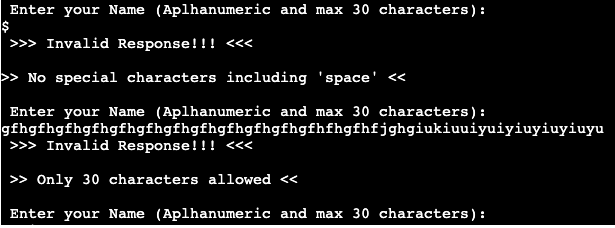

# Mental Math

Mental Math is a terminal game which is python based, it runs on mock terminal on Heroku made by Code Institute.

User of the game needs to solve a set of 10 mathematical questions, the intention should be to resolve them mentally rather than using any aids like calculator or by writing down on paper. The motive is to test ones mathematical skills and ultimately have fun solving these questions.

[ >>> Click here for live version of project <<<](https://mental-math-466801bbea0a.herokuapp.com/)

## How to play

- The game starts by displaying the rules and instructions for the game.
- Player can continue to start playing the game by typing in Y or y after reading instructions.
- Players need to enter their name before starting the game which will be saved along with score once the game ends.
- Name has to be Alphanumeric (a to z , A to Z or 0 to 9) and should have maximum 30 characters. No special characters.
- After entering name one question along with 4 options (A,B,C,D) will appear on screen at a time .
- Player can confirm their answer by typing in A,B,C,D or a,b,c,d. Other inputs will show Invalid Input notification.
- After entering answer the console will display if the answer is correct, if not it will display the correct answer.
- After each question score will be displayed and player can press enter to continue to next question.
- After 10th (last) question user will get to see the final result and an option to restart the game if they wish to.

## Features

### Existing Features

- Welcome message with game instructions

  

- Invalid input detection and notification

  

- Maintains and notifies score throughout the game

  

  

- Records Player Name and Score on score worksheet

  

### Future Features

- Options to selected number of questions
- Introduce time limit to answer each question
- Provide new set of questions if user restarts game

## Data Model

## Testing

The following tests were done to check the projects proper functionality

    - There were no errors found on https://pep8ci.herokuapp.com/ (PEP8 linter)
    - Invalid user inputs were caught and displayed by the game
    - Successfully tested on local terminal , github and Code Institute Heroku terminal 

### Bugs

#### Solved Bugs

    - When the code was initially tested on PEP8 linter, errors were found due to length of certain line of codes. As there is a limit of 79 characters per line, these were restructured.
    - Data on spreadsheet and question_session_handler were restructured in order to avoid exceeding the google API request quotas, this was leading to read request errors initially. 
    - Data (Questions) on the spreadsheet had to reformatted for it to appear properly on the Heroku terminal as they had text content longer than 80 characters.

#### Unsolved Bugs

    - No unsolved bugs remaining

### Validator Testing

    - No errors found on pep8ci.herokuapp.com

## Deployment

The project was deployed using mock terminal on Heroku made by Code Institute.

### Deployment Steps
    - Fork or clone this repository
    - New app was created on Heroku
    - Buildpacks were set to Python and NodeJS in that order
    - The Heroku app was linked to repository
    - Click on Deploy

## Credits

- Thanks to Mr Anthony Ugwu for being a great mentor. He guided me through this projects with his feedback and suggestions. 
- Thanks to Code Institute for providing with template and deployment terminal.
- All codes were written by me.
